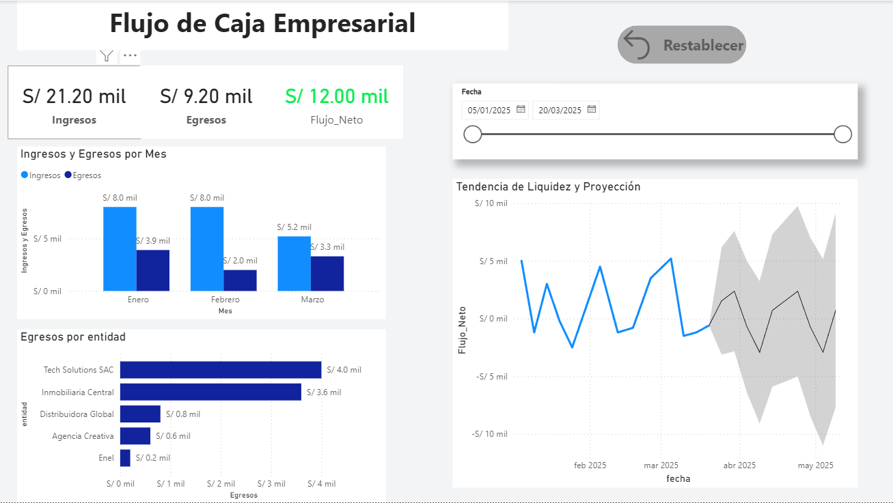
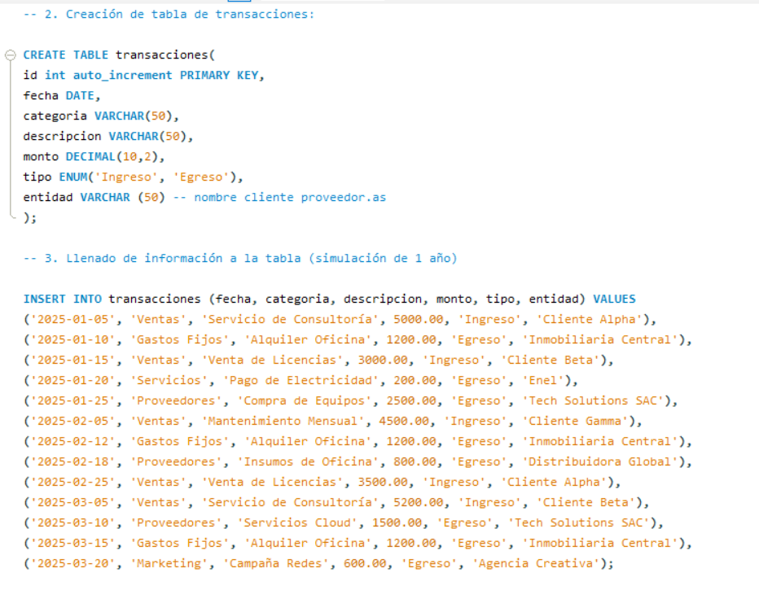
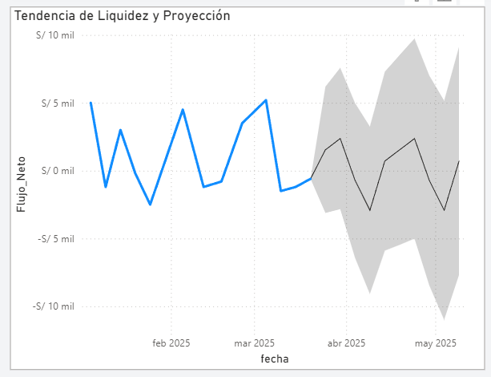

# Dashboard de Flujo de Caja Empresarial 📊

Este proyecto presenta una solución integral para el monitoreo de liquidez corporativa. El objetivo es demostrar habilidades técnicas en la integración de herramientas de análisis de datos (SQL, Excel y Power BI) bajo un flujo de trabajo profesional.

## 🛠️ Herramientas y Tecnologías
* **Base de Datos:** MySQL (Gestión de transacciones y almacenamiento seguro).
* **ETL & Limpieza:** Microsoft Excel (Conexión mediante Power Query y normalización de datos).
* **Visualización:** Power BI (Creación de métricas DAX y dashboard interactivo).

## 📂 Estructura del Proyecto
```text
Proyecto_Flujo_Caja/
│
├── 01_Database.sql          # Código SQL para generar la tabla y datos.
├── 02_Excel_Processing.xlsx  # Archivo puente con la limpieza de datos.
├── 03_PBI_Dashboard.pbix    # Reporte final con visualizaciones dinámicas.
└── img/                     # Carpeta con capturas de pantalla del proyecto.```

📈 Análisis y Métricas Clave
Para este proyecto se implementaron métricas financieras de nivel negocio:

Flujo de Caja Mensual: Comparativo visual entre Ingresos y Egresos para identificar periodos de alta operatividad.

Top 5 Proveedores: Análisis de las mayores salidas de capital por entidad.

Proyección de Liquidez: Uso de modelos analíticos (Forecasting) para predecir la disponibilidad de efectivo.

Alertas de Déficit: Formato condicional inteligente que cambia a rojo cuando el flujo neto es negativo.

📸 Evidencia Visual del Proyecto

1. Dashboard Principal Interactivo


2. Gestión de Datos en MySQL


3. Análisis de Tendencia y Proyección (Forecasting)

